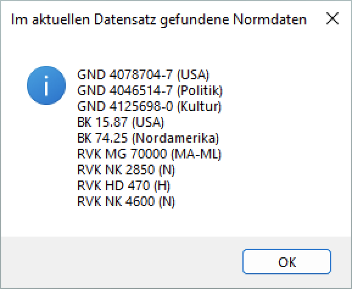

# Integration von WinIBW und Cocoda

Dieses Repository enthält Skripte und Anleitungen zur Integration des
Katalogisierungsclient [WinIBW4] mit der Mapping-Anwendung [Cocoda].

*Achtung: Die Integration befindet sich noch im Aufbau und ist nicht für den Produktivbetrieb gedacht! Des Weiteren ist zu beachten, dass WinIBW4 zum aktuellen Zeitpunkt noch in der Beta und nicht generell verfügbar ist.*

[WinIBW4]: https://wiki.k10plus.de/display/KBSZ/WinIBW4
[Cocoda]: https://coli-conc.gbv.de/cocoda/

## Inhalt <!-- omit in toc -->
- [Installation](#installation)
  - [WinIBW-Skript installieren und einrichten](#winibw-skript-installieren-und-einrichten)
- [Benutzung](#benutzung)
- [Beispieldatensätze in WinIBW](#beispieldatensätze-in-winibw)
- [Entwicklung](#entwicklung)

## Installation

Vorausgesetzt werden die WinIBW4 mit K10plus-Skripten und Firefox oder
Chrome-Browser als Standard-Browser.

### WinIBW-Skript installieren und einrichten

1\. Das GitHub-Repository klonen oder herunterladen.

1.1. Falls es als ZIP-Datei heruntergeladen wurde, muss diese entpackt werden.

2\. WinIBW4 öffnen und den Menüpunkt `Script -> Scriptdateien verwalten` aufrufen.

2.1 Dort unter "Pfad/URL ergänzen" per "Suchen"-Button auf den `scripts`-Ordner im lokalen Repository navigieren und hinzufügen.

2.2 Die Scriptdateien neu laden.

3\. Die Scripte-Verwaltung über den Menüpunkt `Script -> Funktionen (Scripte) verwalten" aufrufen.

3.1 Links in der Liste der verfügbaren Scripte (vermutlich ganz unten) die Funktion "coli_conc" heraussuchen und auswählen.

3.2 Rechts bei "Funktionen auswählen und ordnen" den Punkt "Funktionen auf Schaltflächen" aktivieren.

3.3 Den Button "Am Ende hinzufügen" anklicken.

3.4 Mit OK bestätigen. Der Button `coli_conc` erscheint nun unter der Menüleiste.

3.5 Optional können die speziellen Funktionen der coli-conc Integration als einzelne Buttons hinzugefügt werden. Außerdem kann man unter "Informationen zu Funktionen ergänzen" den Buttons eigene Namen geben. Des Weiteren könnten die Buttons auch in die Menüleiste ("Funktionen in Menüs") oder in die Favoritenleiste ("Funktionen in Favoritenliste") eingefügt werden (siehe WinIBW4-Handbuch).

4\. Über den Button `coli_conc` können nun die verschiedenen Funktionen der coli-conc Integration aufgerufen werden.

## Benutzung

Nach Einrichtung des Skripts kann es über die Funktionsleiste aufgerufen werden.

*Siehe auch die [Anleitung](tutorial.md)*

Folgende Funktionen sind umgesetzt:

* Öffnen von Cocoda aus Normdatensätzen der BK und RVK (`cocodaOpen`)
* Öffnen von Cocoda aus Titeldatensätzen mit BK-, GND- und/oder RVK-Verknüpfungen (`cocodaOpen`)
* Anzeige von Mappings zu genannten Normdatensätzen/Titeldatensätzen (`cocodaMappings`)
* Anzeige von Erkannten Normdaten in einem Datensatz (`cocodaShowConcepts`)

Weitere Funktionen sind geplant (siehe [Issue-Tracker](https://github.com/gbv/cocoda-winibw/issues)).

## Beispieldatensätze in WinIBW

    f ppn 1667549030 # Titeldatensatz mit mehreren BK- und GND-Verknüpfungen
    f ppn 042954150  # Titeldatensatz mit einer BK- und zwei GND-Verknüpfungen
    f ppn 101991983  # BK-Normdatensatz

## Entwicklung

Die WinIBW-Skripte sind in [JavaScript 1.4] geschrieben und nur zusammen mit
einer K10plus-Installation von WinIBW4 lauffähig. Zum automatischen Testen ist
im Verzeichnis `test` eine rudimentäre WinIBW-Mockup-Umgebung enthalten.

    npm install     # Installiert benötigte node-Module
    npm test        # Unit-Tests ausführen
    npm run lint    # Statische Code-Analyse und -Formatierung
    npm run fix     # Code-Formatierung anpassen

Da die Tests mit Node statt mit JavaScript 1.4 laufen, wird nicht die
Verwendung neuerer Sprachkonstrukte erkannt, die in WinIBW zu Fehler führen
würden. Insbesondere wird nicht unterstützt:

* `const` und `let` \*
* [Array-Funktionen](https://developer.mozilla.org/en-US/docs/Web/JavaScript/New_in_JavaScript/1.6) (`forEach`, `map`, `filter`, `find`, ...) (können per [Polyfill] benutzt werden)
* ~~Das [`JSON`-Objekt](https://developer.mozilla.org/it/docs/Web/JavaScript/Reference/Global_Objects/JSON)~~ wurde über einen [Polyfill] hinzugefügt

\*: Dies hat insbesondere Auswirkungen auf den Scope der definierten Variablen. `const` und `let` haben block scope, während `var` function scope hat. Für Details dazu: [You Don't Know JS: Scope & Closures - Chapter 3: Function vs. Block Scope](https://github.com/getify/You-Dont-Know-JS/blob/master/scope%20%26%20closures/ch3.md).

Änderungen sollten zunächst auf dem `dev` Branch getätigt werden.

[JavaScript 1.4]: https://developer.mozilla.org/en-US/docs/Web/JavaScript/New_in_JavaScript/1.4
[Polyfill]: https://github.com/gbv/cocoda-winibw/wiki/JavaScript-Polyfills
