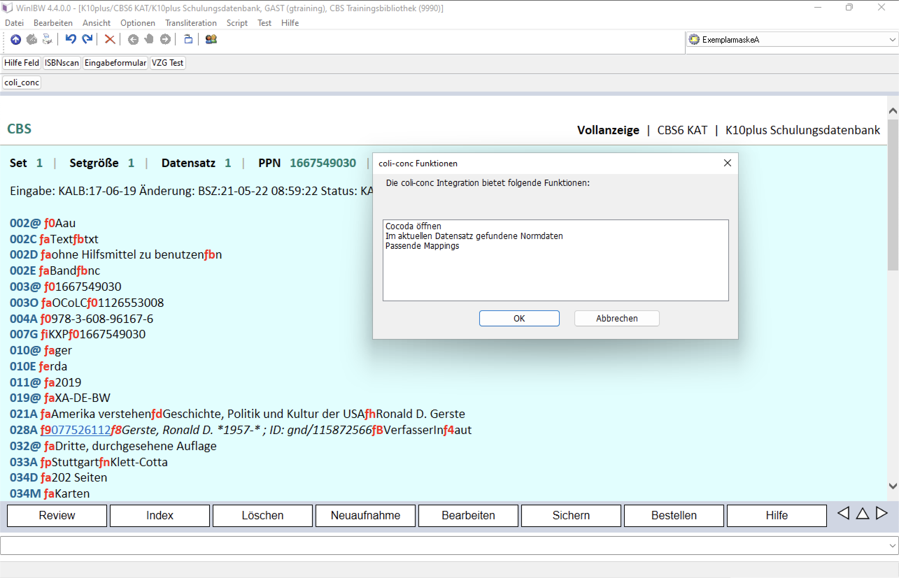
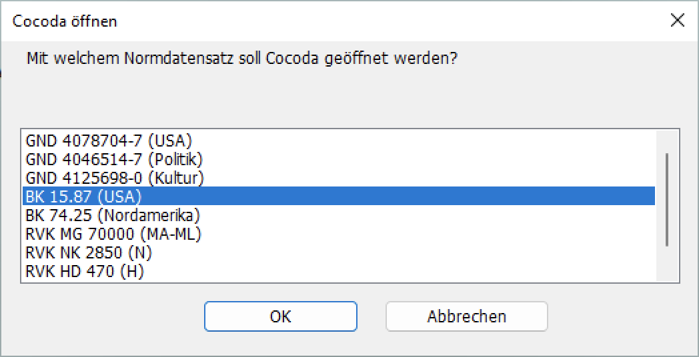
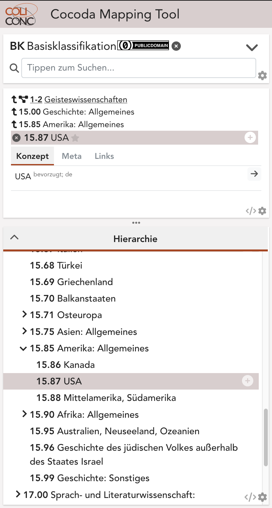
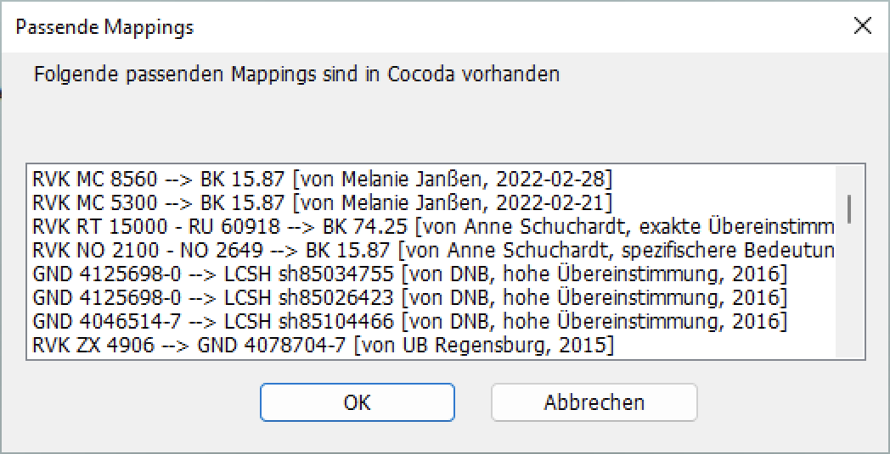
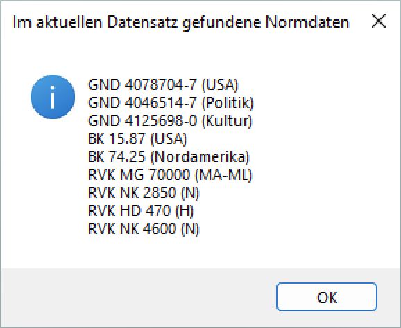

# Anleitung

Nach erfolgreicher Installation und Einrichtung können die Cocoda-Funktionen aus dem Funktionsmenu genutzt werden.

## Cocoda öffnen

Falls mehrere Normdaten im Datensatz erkannt wurden, wird zunächst ein Auswahlmenu angeboten:

Es öffnet sich der Browser mit Cocoda und dem ausgewählten Normdatensatz:

## Mappings nachschlagen

Per JSKOS API können Mappings aus Cocoda (bzw. aus dem von Cocoda verwendeten Konkordanz-Register) nachgeschlagen und in WinIBW angezeigt werden. Aktuell ist lediglich die Anzeige der Mappings möglich.

## Normdaten/Konzepte anzeigen

