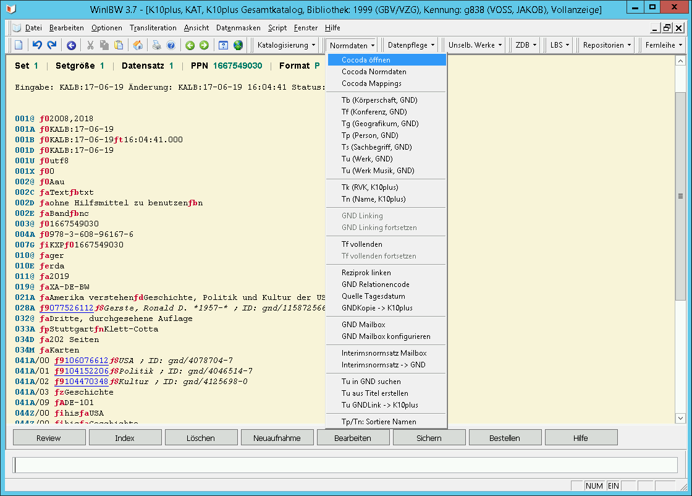
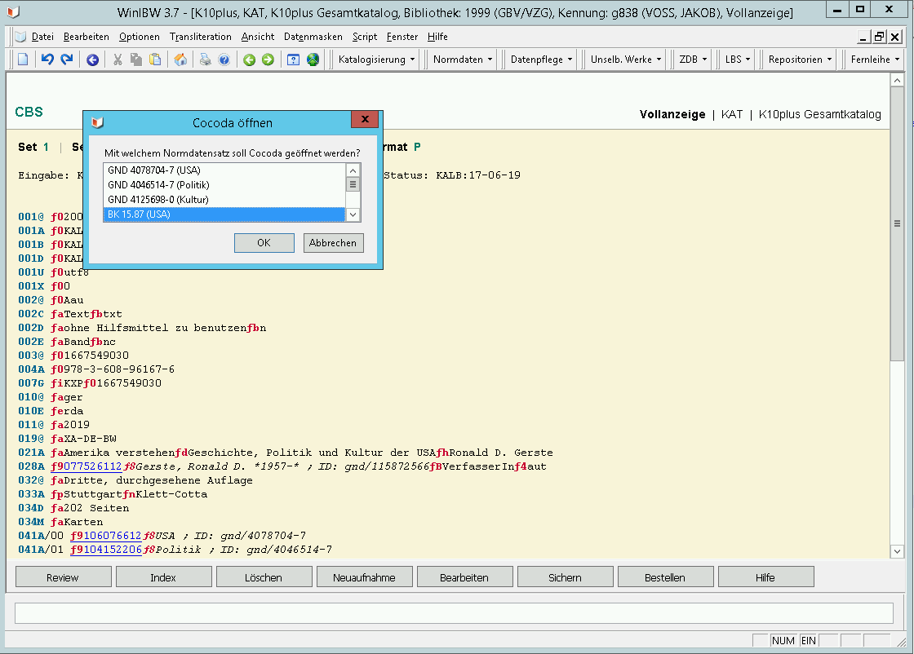
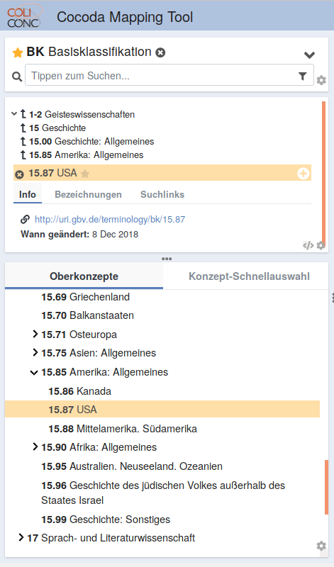

# Anleitung

Nach erfolgreicher Installation und Einrichtung können die Cocoda-Funktionen aus dem Funktionsmenu genutzt werden.

## Cocoda öffnen

Falls mehrere Normdaten im Datensatz erkannt wurden, wird zunächst ein Auswahlmenu angeboten:

Es öffnet sich der Browser mit Cocoda und dem ausgewählten Normdatensatz:

## Mappings Nachschlagen

Per JSKOS API können Mappings aus Cocoda (bzw. aus der von Cocoda verwendeten Konkordanz--Registry) nachgeschlagen und in WinIBW angezeigt werden. Es ist jedoch noch unklar was anschließend mit den Mappings geschehen soll. Die Zahl der Mappings wird zudem schnell sehr unübersichtlich weshalb vermutlich weitere Filter notwendig sind.

